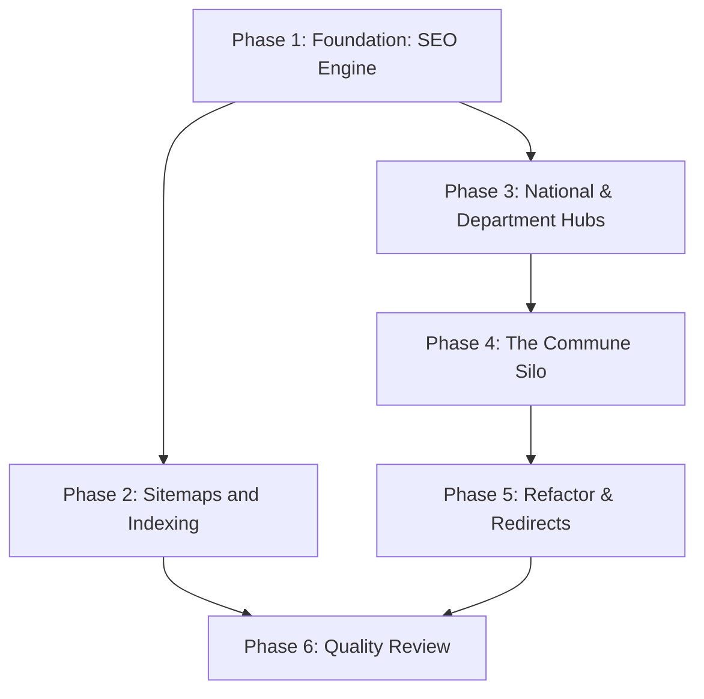

# Implementation Plan: OFFENSIVE MUNICIPALES 2026 SEO

## 1. Plan Overview
- **Total Phases**: 6
- **Agents Involved**: `coder`, `seo_specialist`, `refactor`, `code_reviewer`
- **Estimated Effort**: 2-3 hours

| Phase | Agent | Model | Est. Input | Est. Output | Est. Cost |
|-------|-------|-------|-----------|------------|----------|
| 1 | coder | Pro | 1500 | 500 | $0.035 |
| 2 | seo_specialist | Pro | 1000 | 200 | $0.018 |
| 3 | coder | Pro | 2000 | 600 | $0.044 |
| 4 | coder | Pro | 2500 | 800 | $0.057 |
| 5 | refactor | Pro | 2000 | 500 | $0.040 |
| 6 | code_reviewer | Pro | 3000 | 200 | $0.038 |
| **Total** | | | **12000** | **2800** | **$0.232** |

## 2. Dependency Graph

## 3. Execution Strategy Table
| Batch | Phases | Execution Mode | Agents |
|-------|--------|----------------|--------|
| 1 | Phase 1 | Sequential | `coder` |
| 2 | Phase 2, 3 | Parallel | `seo_specialist`, `coder` |
| 3 | Phase 4 | Sequential | `coder` |
| 4 | Phase 5 | Sequential | `refactor` |
| 5 | Phase 6 | Sequential | `code_reviewer` |

## 4. Phase Details

### Phase 1: Foundation: SEO Engine
- **Objective**: Create the core utility for generating varied semantic summaries to avoid duplicate content penalties.
- **Agent**: `coder`
- **Files to Create**: `lib/seo-engine.ts`
- **Implementation Details**: Implement functions `generateSemanticSummary(results)` and `generateSeoMetadata(city)`. Include logic for formatting the `[code-insee]-[nom-ville]` slug.
- **Validation**: Ensure functions output correctly formatted text without type errors (`npx tsc`).
- **Dependencies**: `blocked_by`: [], `blocks`: [2, 3]

### Phase 2: Sitemaps and Indexing
- **Objective**: Refactor the dynamic sitemap generation to output the new silo URLs for all 35,000 cities.
- **Agent**: `seo_specialist`
- **Files to Modify**: `app/sitemap.ts`
- **Implementation Details**: Update database query to use `lib/seo-engine.ts` formatting logic for slugs. Ensure it can handle 35k rows efficiently.
- **Validation**: Run local build or manual execution of sitemap logic to verify URL format.
- **Dependencies**: `blocked_by`: [1], `blocks`: [6]

### Phase 3: National & Department Hubs
- **Objective**: Build the top two tiers of the silo structure.
- **Agent**: `coder`
- **Files to Create**: `app/elections/municipales-2026/departement/[code-dept]/page.tsx`
- **Files to Modify**: `app/elections/municipales-2026/page.tsx`
- **Implementation Details**: Update National page to list/link departments. Create Department page to list all communes within that department cleanly.
- **Validation**: Check for compilation errors and correct Next.js routing metadata.
- **Dependencies**: `blocked_by`: [1], `blocks`: [4]

### Phase 4: The Commune Silo (ISR/SSG)
- **Objective**: Implement the dynamic commune pages with SSG for top 500 and ISR for the rest.
- **Agent**: `coder`
- **Files to Create**: `app/elections/municipales-2026/commune/[slug]/page.tsx`
- **Implementation Details**: Use `generateStaticParams` to query `radar.db` for the top 500 cities by population. Set `dynamicParams = true` and `revalidate = 60`. Inject JSON-LD schemas.
- **Validation**: Verify `next build` pre-renders exactly 500 pages for this route.
- **Dependencies**: `blocked_by`: [3], `blocks`: [5]

### Phase 5: Refactor & Redirects
- **Objective**: Remove deprecated routes and update component links.
- **Agent**: `refactor`
- **Files to Delete**: `app/elections/municipales-2026/[ville]/page.tsx`
- **Files to Modify**: `components/ElectionResultsLive.tsx`, `next.config.mjs`
- **Implementation Details**: Ensure `ElectionResultsLive` search bar redirects to the new `/commune/[slug]` route. Add 301 redirects in `next.config.mjs` to catch any legacy traffic.
- **Validation**: `npx tsc` and check for broken imports.
- **Dependencies**: `blocked_by`: [4], `blocks`: [6]

### Phase 6: Quality Review
- **Objective**: Final check for SEO compliance, build stability, and code quality.
- **Agent**: `code_reviewer`
- **Files to Modify**: None
- **Implementation Details**: Audit the complete silo structure and ISR configuration. Review metadata and JSON-LD implementation.
- **Validation**: `npm run build` and `npm run lint`.
- **Dependencies**: `blocked_by`: [2, 5], `blocks`: []

## 5. File Inventory
| File | Action | Phase | Purpose |
|------|--------|-------|---------|
| `lib/seo-engine.ts` | Create | 1 | Core semantic and metadata generation logic |
| `app/sitemap.ts` | Modify | 2 | Indexing 35,000 new URLs |
| `app/elections/municipales-2026/page.tsx` | Modify | 3 | National Hub |
| `app/elections/municipales-2026/departement/[code-dept]/page.tsx` | Create | 3 | Department Hub |
| `app/elections/municipales-2026/commune/[slug]/page.tsx` | Create | 4 | Commune Silo (ISR) |
| `app/elections/municipales-2026/[ville]/page.tsx` | Delete | 5 | Remove old structure |
| `components/ElectionResultsLive.tsx` | Modify | 5 | Update search navigation |
| `next.config.mjs` | Modify | 5 | Implement 301 redirects |

## 6. Execution Profile
- Total phases: 6
- Parallelizable phases: 2 (in 1 batch)
- Sequential-only phases: 4
- Estimated parallel wall time: 45 minutes
- Estimated sequential wall time: 60 minutes
