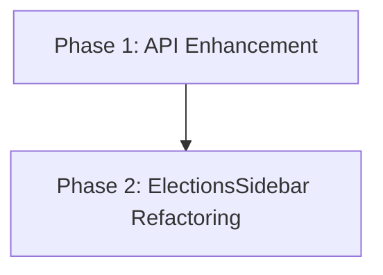

# Implementation Plan: Sidebar City List for Municipales 2026

## 1. Plan Overview
- **Total Phases**: 2
- **Agents Involved**: `coder`, `refactor`
- **Estimated Effort**: 45-60 minutes

| Phase | Agent | Model | Est. Input | Est. Output | Est. Cost |
|-------|-------|-------|-----------|------------|----------|
| 1 | coder | Pro | 1000 | 400 | $0.026 |
| 2 | refactor | Pro | 2000 | 600 | $0.044 |
| **Total** | | | **3000** | **1000** | **$0.070** |

## 2. Dependency Graph

## 3. Execution Strategy Table
| Batch | Phases | Execution Mode | Agents |
|-------|--------|----------------|--------|
| 1 | Phase 1 | Sequential | `coder` |
| 2 | Phase 2 | Sequential | `refactor` |

## 4. Phase Details

### Phase 1: API Enhancement
- **Objective**: Add `list=cities` functionality to the Elections API.
- **Agent**: `coder`
- **Files to Modify**: `app/api/elections/results/route.ts`
- **Implementation Details**: Update the `GET` handler to check for `list_cities=1` and `dep` parameters. When present, query `radar.db` for unique `ville` and `code_insee` for that department.
- **Validation**: Test the API locally: `/api/elections/results?slug=municipales-2026&dep=75&list_cities=1`.
- **Dependencies**: `blocked_by`: [], `blocks`: [2]

### Phase 2: ElectionsSidebar Refactoring
- **Objective**: Integrate the alphabetical city list into the sidebar UI.
- **Agent**: `refactor`
- **Files to Modify**: `components/sidebar/ElectionsSidebar.tsx`
- **Implementation Details**:
    - Import `useSWR` and `formatCommuneSlug`.
    - Fetch cities when `selectedDept` is present.
    - Render a scrollable list of cities with links to the new Silo URLs.
    - Replace the search box with the alphabetical list for the selected department.
- **Validation**: Verify that clicking a department reveals the alphabetical list and clicking a city navigates to the correct Silo page.
- **Dependencies**: `blocked_by`: [1], `blocks`: []

## 5. File Inventory
| File | Action | Phase | Purpose |
|------|--------|-------|---------|
| `app/api/elections/results/route.ts` | Modify | 1 | API support for city listing |
| `components/sidebar/ElectionsSidebar.tsx` | Modify | 2 | Display alphabetical city list |

## 6. Execution Profile
- Total phases: 2
- Parallelizable phases: 0
- Sequential-only phases: 2
- Estimated sequential wall time: 45 minutes
