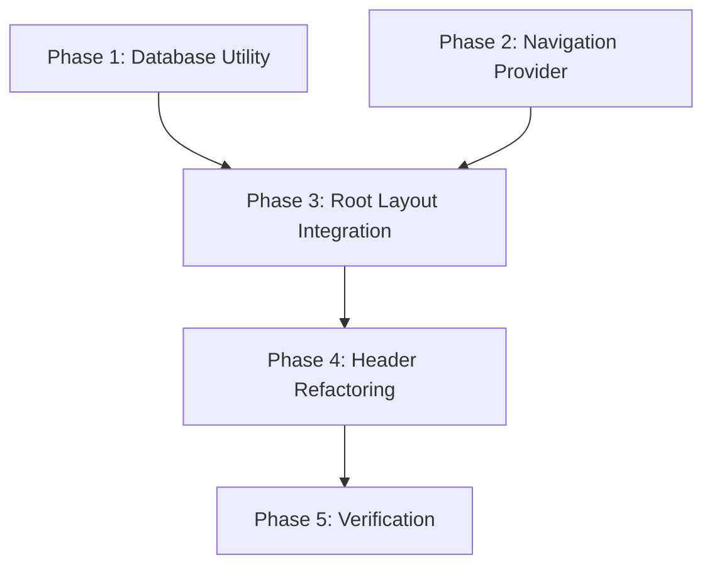

# Implementation Plan: Server-Side Navigation Flow

## 1. Plan Overview
This plan implements a server-side data flow for navigation items, ensuring that the `Header` component reflects the latest database state without relying on client-side caching.

**Total Phases**: 5
**Agents**: `data_engineer`, `coder`, `tester`
**Estimated Effort**: 4-6 hours

## 2. Dependency Graph

## 3. Execution Strategy Table
| Stage | Phase | Agent | Mode |
|-------|-------|-------|------|
| Foundation | Phase 1 & 2 | `data_engineer`, `coder` | Parallel |
| Integration | Phase 3 | `coder` | Sequential |
| Refactoring | Phase 4 | `coder` | Sequential |
| Verification | Phase 5 | `tester` | Sequential |

## 4. Phase Details

### Phase 1: Database Utility
- **Objective**: Create a server-side utility to fetch navigation items directly from the SQLite database.
- **Agent**: `data_engineer`
- **Files to Create**: `lib/db-nav.ts`
- **Implementation Details**:
  - Export a function `getNavItems(all: boolean = false): NavItem[]`.
  - Reuse logic from `app/api/radar/nav/route.ts` but optimize for server-side direct access.
  - Handle table creation and seeding if the database is empty.
- **Validation**: Manual unit test via a temporary script to verify database fetch.

### Phase 2: Navigation Provider
- **Objective**: Create a client-side React context provider to share navigation state.
- **Agent**: `coder`
- **Files to Create**: `components/NavProvider.tsx`
- **Implementation Details**:
  - Create a `NavContext` and `NavProvider`.
  - The provider should accept `initialNavItems` as props and provide them to children.
- **Validation**: Verify the provider compiles and correctly exports the context hook.

### Phase 3: Root Layout Integration
- **Objective**: Fetch navigation in the server-side root layout and wrap the application in the provider.
- **Agent**: `coder`
- **Files to Modify**: `app/layout.tsx`
- **Implementation Details**:
  - Import `getNavItems` from `lib/db-nav.ts`.
  - Fetch `navItems` in the `RootLayout` component.
  - Wrap the `children` (and `root` div) in `NavProvider`.
- **Validation**: Verify the page still renders and the server-fetched data is available in the provider.

### Phase 4: Header Component Refactoring
- **Objective**: Refactor the `Header` component to consume navigation from the provider.
- **Agent**: `coder`
- **Files to Modify**: `components/Header.tsx`
- **Implementation Details**:
  - Remove `sessionStorage` logic and internal `useEffect` fetch.
  - Use the `useNav()` hook from `NavProvider` to get navigation items.
  - Ensure the "LIVE" badge and other dynamic elements are correctly rendered from the server data.
- **Validation**: Verify that the header renders correctly without any client-side delay.

### Phase 5: Verification & Cleanup
- **Objective**: Verify end-to-end synchronization and remove any legacy code.
- **Agent**: `tester`
- **Implementation Details**:
  - Toggle rubriques in the Radar-Admin.
  - Verify immediate reflection on the public frontend.
  - Check browser console and network tabs for any leftover `sessionStorage` or fetch calls.
- **Validation**: Successful end-to-end synchronization without caching issues.

## 5. File Inventory
| File | Phase | Action | Purpose |
|------|-------|--------|---------|
| `lib/db-nav.ts` | 1 | Create | Database utility for server-side nav fetching. |
| `components/NavProvider.tsx` | 2 | Create | Context provider for navigation state. |
| `app/layout.tsx` | 3 | Modify | Initialize NavProvider with server-fetched data. |
| `components/Header.tsx` | 4 | Modify | Consume nav items from context, remove caching. |

## 6. Risk Classification
- **Phase 1**: LOW (Read-only database operation)
- **Phase 2**: LOW (Standard React Context)
- **Phase 3**: MEDIUM (Modifying root layout, potential impact on entire app)
- **Phase 4**: MEDIUM (Modifying core UI component, potential for layout shift)
- **Phase 5**: LOW (Validation)

## 7. Execution Profile
- Total phases: 5
- Parallelizable phases: 2 (Phase 1 & 2)
- Sequential-only phases: 3
- Estimated parallel wall time: ~4 hours
- Estimated sequential wall time: ~6 hours

Note: Parallel dispatch runs agents in autonomous mode (--approval-mode=yolo).
All tool calls are auto-approved without user confirmation.
