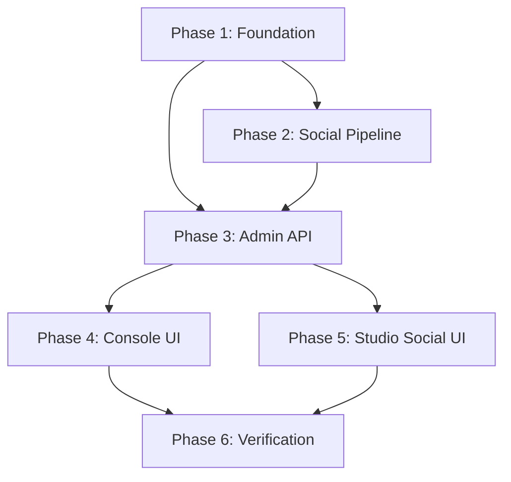

# Implementation Plan: Radar Console & Enhanced Social Publishing

## 1. Plan Overview
This plan implements a real-time monitoring console for the Radar daemon, fixes social media link logic, and introduces a "Studio Social" for direct, customizable broadcasting.

**Total Phases**: 6
**Agents**: `data_engineer`, `coder`, `tester`
**Estimated Effort**: 6-8 hours

## 2. Dependency Graph

## 3. Execution Strategy Table
| Stage | Phase | Agent | Mode |
|-------|-------|-------|------|
| Foundation | Phase 1 | `data_engineer` | Sequential |
| Core Logic | Phase 2 | `data_engineer` | Sequential |
| API Layer | Phase 3 | `coder` | Sequential |
| Integration | Phase 4 & 5 | `coder` | Parallel |
| Quality | Phase 6 | `tester` | Sequential |

## 4. Phase Details

### Phase 1: Foundation (Data & Env)
- **Objective**: Prepare the database and environment for new features.
- **Agent**: `data_engineer`
- **Files to Modify**: 
  - `radar_lassez/init_db.js`: Add `radar_social_drafts` table creation.
  - `radar_lassez/.env`: Add `FRONTEND_URL=https://lassez.fr`.
- **Validation**: Run `node radar_lassez/init_db.js` and verify table existence.

### Phase 2: Core Logic Enhancement (Social Pipeline)
- **Objective**: Fix social links and implement link skipping for FLASH articles.
- **Agent**: `data_engineer`
- **Files to Modify**:
  - `radar_lassez/socials.js`: Add `skipLink` parameter to `broadcastToSocials` and all network-specific functions. Use `FRONTEND_URL`.
  - `radar_lassez/publishPost.js`: logic to determine `skipLink` (e.g., if content has #FLASH or specific metadata) and pass it to `broadcastToSocials`.
- **Validation**: Manual code review and simulation of a social post with `skipLink=true`.

### Phase 3: Logic Extension (Admin API)
- **Objective**: Create the server-side endpoints for logs and custom social posts.
- **Agent**: `coder`
- **Files to Create**:
  - `app/api/radar/logs/route.ts`: Reads last 500 lines of `radar_lassez/daemon.log`.
  - `app/api/radar/social-custom/route.ts`: Saves drafts to `radar_social_drafts` and calls `radar_lassez/socials.js`'s `broadcastToSocials`.
- **Validation**: Test endpoints with `curl` or Postman.

### Phase 4: UI Integration (Radar Console)
- **Objective**: Add a real-time log viewer to the Radar-Admin.
- **Agent**: `coder`
- **Files to Modify**:
  - `app/radar-admin/page.tsx`: Add "Console" tab, implement log polling every 5-10 seconds.
- **Validation**: Verify logs appear and update in the UI.

### Phase 5: UI Integration (Studio Social)
- **Objective**: Add the custom social post drafting and sending UI.
- **Agent**: `coder`
- **Files to Modify**:
  - `app/radar-admin/page.tsx`: Add "Studio Social" tab with form (Text, Image URL), "Save Draft", and "Broadcast Now" buttons.
- **Validation**: Verify drafting and broadcasting flow.

### Phase 6: Verification & Final Polish
- **Objective**: Full end-to-end testing and cleanup.
- **Agent**: `tester`
- **Validation Criteria**:
  - Toggling rubriques updates DB immediately.
  - FLASH articles on socials have no links.
  - Other articles link to `lassez.fr` correctly.
  - "Console" shows real-time daemon logs.
  - "Studio Social" sends custom posts successfully.

## 5. File Inventory
| File | Phase | Action | Purpose |
|------|-------|--------|---------|
| `radar_lassez/init_db.js` | 1 | Modify | Add `radar_social_drafts` table. |
| `radar_lassez/.env` | 1 | Modify | Add `FRONTEND_URL`. |
| `radar_lassez/socials.js` | 2 | Modify | Support `skipLink` and `FRONTEND_URL`. |
| `radar_lassez/publishPost.js` | 2 | Modify | Inject `skipLink` for FLASH articles. |
| `app/api/radar/logs/route.ts` | 3 | Create | API for log retrieval. |
| `app/api/radar/social-custom/route.ts` | 3 | Create | API for custom social broadcasting. |
| `app/radar-admin/page.tsx` | 4, 5 | Modify | Add "Console" and "Studio Social" tabs. |

## 6. Risk Classification
- **Phase 1 & 2**: LOW
- **Phase 3**: MEDIUM (New API endpoints)
- **Phase 4 & 5**: MEDIUM (Complex UI state management)
- **Phase 6**: LOW

## 7. Execution Profile
- Total phases: 6
- Parallelizable phases: 2 (Phase 4 & 5)
- Sequential-only phases: 4
- Estimated parallel wall time: ~5 hours
- Estimated sequential wall time: ~8 hours

Note: Parallel dispatch runs agents in autonomous mode (--approval-mode=yolo).
All tool calls are auto-approved without user confirmation.
